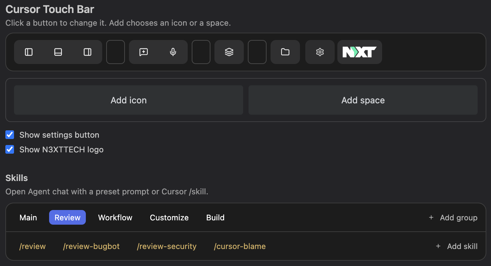
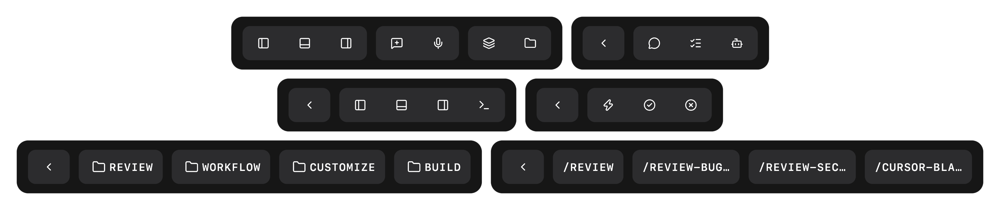

# Cursor Touch Bar



Full control of the Mac Touch Bar in [Cursor](https://cursor.com) and VS Code: your buttons, your actions, ready to use out of the box.

## Features

- **Groups.** Up to ten buttons on the main row; spaces split them into groups; drag to reorder in settings.
- **Actions.** Each slot gets a built-in action or any Cursor or VS Code command, plus its own icon.
- **Layers.** A button can open another row (Modes, Skills, Layout, Chat, Review, or General) instead of running a command; Back returns to the main row.
- **Skills.** Named text shortcuts in folders; tap to open a new chat with the prompt filled in.
- **Library.** A large searchable set of Lucide icons and common commands when you configure a button.
- **Presets.** A ready-to-use bar on first install and [Cursor built-in skills](https://cursor.com/docs/skills) as `/skill-name` shortcuts in Review, Workflow, Customize, and Build.



## Settings

Tap the gear, or run **Cursor Touch Bar: Configure Buttons**. Click a button on the preview to change its icon, action, or place. **+** adds a button or a space.

If chat lives in the unified sidebar, use **Unified sidebar** instead of Right panel. Hide the gear with `"cursorTouchBar.showConfigButton": false`.

The same options live in settings.json (`Cmd+Shift+P` → **Preferences: Open User Settings (JSON)**). A slot you leave out keeps its default. See [`examples/settings.example.jsonc`](examples/settings.example.jsonc).

```jsonc
{
  "cursorTouchBar.buttons": {
    "slot3": {
      "enabled": true,
      "icon": "panel-right",
      "type": "command",
      "command": "workbench.action.toggleUnifiedSidebar"
    }
  },
  "cursorTouchBar.skills": [
    {
      "id": "review",
      "label": "Review",
      "prompt": "Review the current changes and list the risks.",
      "group": "Git"
    }
  ]
}
```

## Requirements

- macOS with a physical Touch Bar
- Cursor or VS Code

Layout, save, palette, and terminal work in both. Ask, Plan, Agent, and New chat are Cursor commands.

## Installation

### From a packaged `.vsix`

```bash
npm install -g @vscode/vsce
vsce package --no-dependencies
```

`--no-dependencies` is required. This extension has no runtime dependencies, and `vsce` fails its dependency step without one.

Then in Cursor: `Extensions` → `...` menu → **Install from VSIX...** and pick `cursor-touch-bar-0.2.0.vsix`.

### From source

```bash
git clone https://github.com/mhd-fettah/Cursor-TouchBar.git
cd Cursor-TouchBar
```

Open the folder in Cursor and press `F5` to launch an Extension Development Host with Cursor Touch Bar loaded.

## Regenerating icons

Icons are [Lucide](https://lucide.dev) PNGs. The list lives in [`catalog.js`](catalog.js).

```bash
brew install librsvg   # provides rsvg-convert
./icons-download.sh
node scripts/build-char-icons.js   # Touch Bar label letters (macOS; committed PNGs)
node scripts/build-manifest.js
node scripts/render-touchbar-showcase.js   # docs/touchbar-showcase.png
```

`build-manifest.js` writes the Touch Bar commands into `package.json`. Cursor can only show an icon that is registered there.

## Contributing

Issues and PRs welcome. If a Cursor update renames a command and a button stops working, open an issue with the Cursor version you are on.

## Credit

Fork of [ShipBar](https://github.com/max-blackwell/ShipBar) by Max Blackwell.

## License

[MIT](LICENSE)
